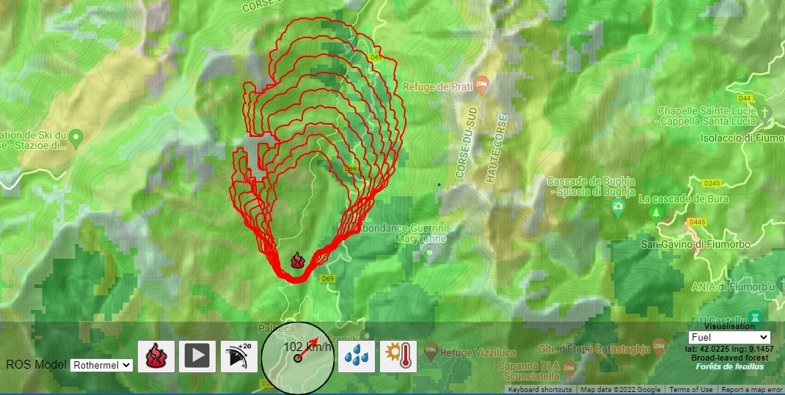

# ForeFire


<!-- _Refer to the [Wiki](https://github.com/forefireAPI/firefront/wiki) for a more detailed guide on using ForeFire._ -->

ForeFire is an [open-source code for wildland fire spread models](https://www.researchgate.net/publication/278769168_ForeFire_open-source_code_for_wildland_fire_spread_models), developed and maintained by Université de Corse Pascal Paoli.

Access the [demo simulator here](http://forefire.univ-corse.fr/sim).




It has been designed and runs on Unix systems. Three modules can be built with the source code.

The main binaries are  
  - An interpreter (executable)
  - A shared library (with C/C++/Java Python and Fortran bindings)

## 1. Building from source

ForeFire can be built from source by running `install-forefire.sh`

```
cd forefire

sudo sh install-forefire.sh

```

You can inspect this file to understand the necessary linux dependencies and commands

The program will be built in: `./bin/forefire`


To make the program executable from eveywhere (during the session) Add the bin folder to path

```
export PATH=$PATH:`pwd`/bin
```
If you want to change it permanently, paste
```
export PATH="</path/to/file>:$PATH"
```
at the end of your `~/.bashrc` file, that can be edited with `nano ~/.bashrc`

## 2. Running an example

Examples are provided on the `tests` folder. You can inspect `tests/runff/run.bash` for instance.

## 3. Running with python
Go and check [./bindings/python/README.md](./bindings/python/README.md)

## 4. Building with Docker
A sample Dockerfile can allow to build a Docker image with
```
docker build . -t forefire
```

To run this image and interactively acces the continer use
```
docker run -it forefire bash
```
