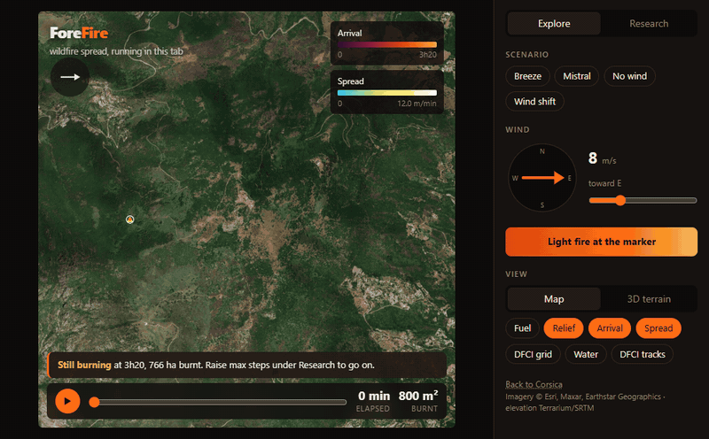
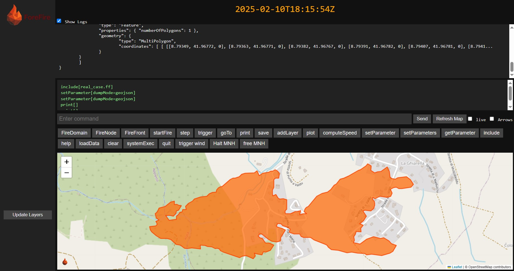

<p align="center">
  
</p>

[](https://github.com/forefireAPI/forefire/actions/workflows/main.yml)
[](https://forefire.readthedocs.io/en/latest/?badge=latest)
[](https://pypi.org/project/forefire/)
[](https://doi.org/10.21105/joss.08680)

**ForeFire** is an open-source wildfire spread simulator written in C++,
developed by CNRS at the [Université de Corse Pascal Paoli](https://www.univ-corse.fr/).

## Try it now, no install

**[In-browser demo](https://forefireapi.github.io/forefire/)** · **[Live demo](https://forefire.univ-corse.fr/sim)**

The in-browser demo is the engine compiled to WebAssembly, running in your tab
on terrain and fuel built from map tiles. Click the map to light a fire, set the wind, and watch it spread.

<p align="center">
  <a href="https://forefireapi.github.io/forefire/">
    
  </a>
</p>

## Run it from Python

On Linux and macOS, `pip install forefire` gives you a self-contained wheel
(NetCDF is bundled) with the `pyforefire` module and the `forefire`
command-line interpreter. NumPy and Matplotlib come with it.

```bash
pip install forefire
```

Save this as `spread.py` and run `python spread.py`. It lights a fire on a
4 km square of uniform fuel with an 8 m/s wind and draws the front every
30 seconds into `fronts.png`:

```python
import numpy as np
import matplotlib.pyplot as plt
import pyforefire as forefire
from pyforefire.helpers import printToPathe

ff = forefire.ForeFire()
ff["fuelsTable"] = "Index;vv_coeff\n1;1.0"
ff["propagationModel"] = "WindDriven"
ff.execute("FireDomain[sw=(0,0,0);ne=(4000,4000,0);t=0]")

# Uniform fuel and a wind field, as NumPy arrays over the 4 km domain
fuel = np.ones((1, 1, 200, 200))
wind = np.zeros((2, 2, 200, 200))
wind[0, 0] = 1.0  # windU, unit vector in x
wind[1, 1] = 1.0  # windV, unit vector in y
ff.addLayer("propagation", "WindDriven", "propagationModel")
ff.addIndexLayer("table", "fuel", 0, 0, 0, 4000, 4000, 0, fuel)
ff.addScalarLayer("windScalDir", "windU", 0, 0, 0, 4000, 4000, 0, wind[0:1])
ff.addScalarLayer("windScalDir", "windV", 0, 0, 0, 4000, 4000, 0, wind[1:2])

ff.execute("startFire[loc=(1000,2000,0);t=0]")
ff.execute("trigger[wind;loc=(0,0,0);vel=(8,3,0)]")
for _ in range(8):
    ff.execute("step[dt=30]")
    for path in printToPathe(ff.execute("print[]")):
        plt.plot(*path.vertices.T, color="tab:red")

plt.gca().set_aspect("equal")
plt.savefig("fronts.png")
print("wrote fronts.png")
```

Open `fronts.png`: eight nested perimeters, stretched downwind. To paint your
own fuel map, wind field or terrain, see
[Running from NumPy arrays](https://forefire.readthedocs.io/en/latest/user_guide/python_arrays.html).

Published wheels are built without MPI. For fire-atmosphere coupling with
Meso-NH, or to tune the build for your CPU, [build from source](#build-from-source).

## Run the web GUI with Docker

The published image includes the interpreter, the web GUI and a real case in
Corsica (`tests/runff`):

```bash
docker run -it --rm -p 127.0.0.1:8000:8000 ghcr.io/forefireapi/forefire:latest
```

`127.0.0.1:` keeps the port on this machine. A bare `-p 8000:8000` publishes
it on every interface, so anyone on the network could send commands to the
server. To build the image yourself instead, run `docker build -t forefire .`
in a clone and use `forefire` as the image name.

Inside the container, start the interpreter next to the sample data and open
the HTTP server. Bind it to `0.0.0.0` so the published port reaches it
(`listenHTTP[]` alone listens only on the container's own localhost):

```bash
cd tests/runff
forefire
```

```text
forefire> listenHTTP[0.0.0.0:8000]
```

Open <http://localhost:8000/>, click **`include`** (or type
`include[real_case.ff]`) and **Send**, then **Refresh Map**. Running the
command again continues the simulation. The `systemExec is not available over
HTTP` line it prints is expected: the script's data check only runs from the
console.



The sample data under `tests/` is stored in Git LFS. If you work from a clone
rather than the published image, install Git LFS before cloning, or `data.nc`
will be a small pointer file instead of the dataset.

## Build from source

`install-forefire.sh` (Linux) and `install-forefire-osx.sh` (macOS) install the
dependencies and build; the
[documentation](https://forefire.readthedocs.io/en/latest/) covers the details.
The CMake build is option-driven. The defaults below are what a plain
`cmake -S . -B build` gives you:

| Option | Default | Purpose |
| --- | --- | --- |
| `FOREFIRE_ENABLE_MPI` | `ON` | Enable MPI coupling when MPI is available. |
| `FOREFIRE_ENABLE_NETCDF` | `ON` | Build with NetCDF support (`OFF` compiles in-memory and WASM builds without `libnetcdf`). |
| `FOREFIRE_NATIVE_ARCH` | `ON` | Compile with `-march=native`. Turn off for binaries that must run on other machines. |
| `FOREFIRE_BUILD_CLI` | `ON` | Build the `forefire` command-line executable. |
| `FOREFIRE_BUILD_PYTHON` | `OFF` | Build the `pyforefire` extension module. |
| `FOREFIRE_BUILD_WASM` | `OFF` | Build the Emscripten WebAssembly module (`forefire.mjs` + `forefire.wasm`). |
| `FOREFIRE_STATIC_CORE` | `OFF` | Build the core as a static library instead of `libforefireL`. |
| `FOREFIRE_BUILD_TOOLS` | `ON` | Build the `ANN_test` helper executable. |
| `FOREFIRE_CHECK_LFS` | `ON` | Run the Git LFS integrity check while configuring. |
| `FOREFIRE_BUILD_TESTS` | `ON` | Build the C++ unit tests and register them with CTest. |
| `FOREFIRE_ENABLE_WARNINGS` | `ON` | Compile ForeFire's own sources with `-Wall -Wextra`. |
| `FOREFIRE_WARNINGS_AS_ERRORS` | `OFF` | Fail the build on any compiler warning. Not yet usable repository-wide. |
| `FOREFIRE_SANITIZE` | `""` | Sanitizers to build with, passed to `-fsanitize=` (e.g. `address`). |

Wheel builds (anything driven by `pip`) flip seven of these to the portable defaults:
no MPI, no `-march=native`, static core, Python module on, no tools, no LFS check, no tests.

[TESTING.md](TESTING.md) covers the test suites and the sanitizer build.

### Coupled with Meso-NH

One script takes a bare Linux machine to a running fire-atmosphere case with
[Meso-NH](https://mesonh.cnrs.fr/) (Pedrógão Grande, 4 MPI processes, about 7 min):

```bash
tests/mnh_coupled.bash
```

Options, the live 3D view and the manual setup are in the
[Meso-NH guide](https://forefire.readthedocs.io/en/latest/user_guide/mesonh.html).

## What's in the box

- A C++ engine that tracks the fire front as a set of moving nodes, with
  pluggable rate-of-spread models (Rothermel, several Balbi variants, Farsite,
  and simple wind-driven or isotropic ones for teaching).
- The `forefire` interpreter: `.ff` scripts, an interactive console, and a web
  GUI served by `listenHTTP[]`.
- `libforefireL` for embedding, and Python bindings that take NumPy arrays.
- Landscape input from NetCDF or from arrays; output to KML, GeoJSON, NetCDF
  and text.
- Two-way coupling with the Meso-NH atmospheric model through MPI.

More: [documentation](https://forefire.readthedocs.io/en/latest/) ·
[website](https://forefire.univ-corse.fr/) · [changelog](CHANGELOG.md)

## Python bindings

The `pyforefire` module drives the same engine as the interpreter: run `.ff`
commands, pass layers as NumPy arrays, and run simulations side by side in
worker processes with `ForeFireRunner`. See
[bindings/python/README.md](bindings/python/README.md).

## Contributing

Contributions are welcome, especially to the documentation and tutorials, the
Python bindings, and packaging (Docker, pip) across platforms. Read the
[contributing guidelines](CONTRIBUTING.md) for how to report bugs, suggest
features and submit changes. All contributors are expected to follow the
[Code of Conduct](CODE_OF_CONDUCT.md).

## License

ForeFire is licensed under the GNU General Public License v3.0. See
[LICENSE](LICENSE).

## Citation

If you use ForeFire in your work, please cite:

**BibTex**
```bibtex
@article{ForeFireJOSS2025,
  title = {ForeFire: A Modular,  Scriptable C++ Simulation Engine and Library for Wildland-Fire Spread},
  volume = {10},
  ISSN = {2475-9066},
  url = {http://dx.doi.org/10.21105/joss.08680},
  DOI = {10.21105/joss.08680},
  number = {116},
  journal = {Journal of Open Source Software},
  publisher = {The Open Journal},
  author = {Filippi,  Jean-Baptiste and Baggio,  Roberta and Paugam,  Ronan and Bosseur,  Frédéric and Leblanc,  Antonio and Alonso-Pinar,  Alberto},
  year = {2025},
  month = dec,
  pages = {8680}
}
```

**Plain Text**
> Filippi, J.-B., Baggio, R., Paugam, R., Bosseur, F., Leblanc, A., & Alonso-Pinar, A. (2025). ForeFire: A Modular, Scriptable C++ Simulation Engine and Library for Wildland-Fire Spread. Journal of Open Source Software, 10(116), 8680. https://doi.org/10.21105/joss.08680
