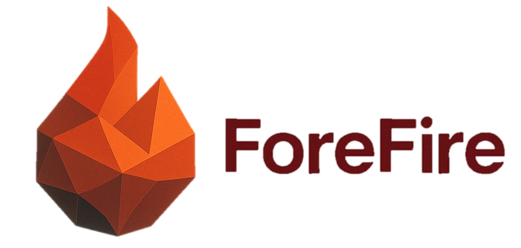

<p align="center">
  
</p>


---
[](https://www.researchgate.net/publication/278769168_ForeFire_open-source_code_for_wildland_fire_spread_models) <!-- Or use Zenodo DOI if available -->
[](https://www.gnu.org/licenses/gpl-3.0)
[](https://github.com/forefireAPI/firefront/actions/workflows/main.yml)


[](https://your-rtd-project-name.readthedocs.io/en/latest/?badge=latest) <!-- Add your RTD project name -->

<!-- _Refer to the [Wiki](https://github.com/forefireAPI/firefront/wiki) for a more detailed guide on using ForeFire._ -->

**ForeFire** is an open-source wildfire spread simulator written in C++. Developed by CNRS at the [Université de Corse Pascal Paoli](https://www.univ-corse.fr/), it's designed for research and operational forecasting. ForeFire implements various fire behavior models (e.g., based on Rothermel equations), handles complex geospatial data, and enables high-fidelity coupled fire-atmosphere simulations via integration with atmospheric models like [MesoNH](https://mesonh.aero.obs-mip.fr/mesonh/) (developed by CNRS & Météo-France).

**Key Links:**
*   🌍 **Website:** [forefire.univ-corse.fr](https://forefire.univ-corse.fr/)
*   🚀 **Live Demo:** [forefire.univ-corse.fr/sim](http://forefire.univ-corse.fr/sim)
<!-- *   📚 **Full Documentation:** [your-rtd-project-name.readthedocs.io](https://your-rtd-project-name.readthedocs.io/en/latest/)  -->

## Features

*   **Advanced Simulation:** Core C++ engine for fire propagation using geospatial data (terrain, fuel, weather).
*   **Fire-Atmosphere Coupling:** Integrates with MesoNH for realistic wind-fire interaction modeling.
*   **High Performance:** Optimized for speed, capable of faster-than-real-time simulations on laptops, with MPI support for parallel computing.
*   **Multiple Interfaces:** Usable via C++ library, Python bindings, interactive console (IPython-like), web interface (notebook mode), and shell scripts.
*   **Extensible:** Add custom Rate of Spread (ROS) models in C++; customize web interfaces using HTML/JS.
*   **Applications:** Suitable for research, detailed case reanalysis, and ensemble forecasting.


## Quick Start

The easiest way to get started is often using Docker. Alternatively, build from source using the provided script.

**1. Using Docker (Recommended)**

```bash
# Build the Docker image
docker build . -t forefire:latest

# Run the container interactively
docker run -it forefire:latest bash

# Inside the container, run an example:
cd tests/runff
bash run.bash
```
We will soon allow docker to run forefire with the interactive console

**2. From Source (using install script)**

``` bash
# Clone the repository
git clone https://github.com/forefireAPI/firefront.git
cd firefront

# Prerequisites:
# You need a C++ compiler, CMake, Make, and libraries like NetCDF.
# See the Documentation or inspect install-forefire.sh for details.

sudo bash install-forefire.sh

# The executable will be built in: `./bin/forefire`

# Examples are provided on the `tests` folder. You can inspect `tests/runff/run.bash` to check usage
# example
cd tests/runff
bash run.bash

```
(For manual CMake build instructions, see the Full Documentation).

### Python Bindings
ForeFire provides Python bindings for easier scripting and integration. See the Python Bindings [./bindings/python/README.md](./bindings/python/README.md) for details.

<!-- ### Contributing -->

### License
ForeFire is licensed under the GNU General Public License v3.0. 

### Citation
If you use ForeFire in your work, please cite:
```
Filippi, Jean-Baptiste & Bosseur, Frédéric & Grandi, Damien. (2014). ForeFire: open-source code for wildland fire spread models. 10.14195/978-989-26-0884-6_29. 
```