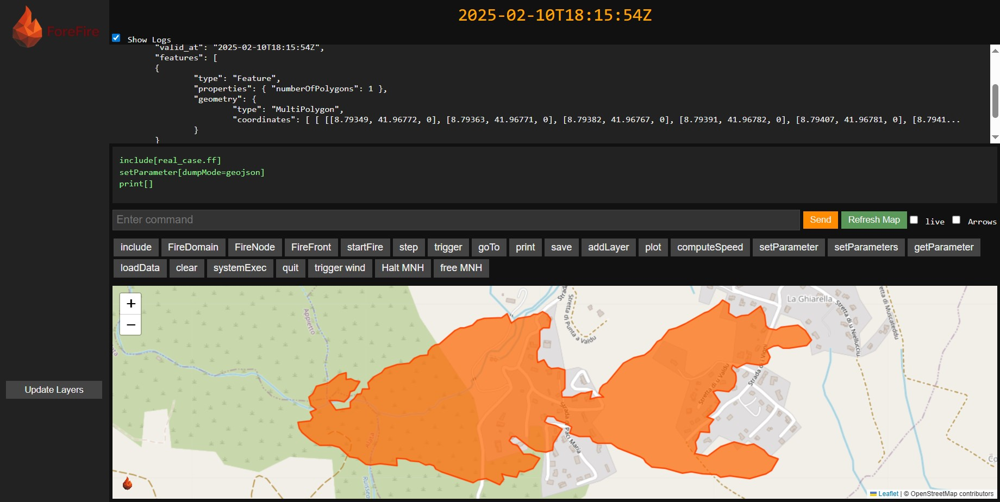

<p align="center">
  
</p>


---
<!-- Identity & Citation -->
[](https://www.gnu.org/licenses/gpl-3.0)
[](https://www.researchgate.net/publication/278769168_ForeFire_open-source_code_for_wildland_fire_spread_models) <!-- Or use Zenodo DOI if available -->
<!-- Project Health & Status -->
[](https://github.com/forefireAPI/forefire/actions/workflows/main.yml)
[](https://github.com/forefireAPI/forefire/actions/workflows/macos.yml)
[](https://github.com/forefireAPI/forefire/actions/workflows/docker.yml)
[](https://forefire.readthedocs.io/en/latest/?badge=latest)
<!-- Distribution and Technical Stack -->
[](https://github.com/forefireAPI/forefire/pkgs/container/forefire)


**ForeFire** is an open-source **wildfire simulation engine** written in C++. Developed by CNRS at the [Université de Corse Pascal Paoli](https://www.univ-corse.fr/), it is used for research and operational forecasting. The engine implements various fire behavior models and enables high-fidelity coupled fire-atmosphere simulations, aiming to improve wildfire prediction and understanding for complex environments.


**Key Links:**
- 📚 **Full Documentation:** [forefire.readthedocs.io](https://forefire.readthedocs.io/en/latest/)
- 🚀 **Live Demo:** [forefire.univ-corse.fr/sim](http://forefire.univ-corse.fr/sim)
- 🌍 **Website:** [forefire.univ-corse.fr](https://forefire.univ-corse.fr/)

## Features

*   **Advanced Simulation Engine:** Core C++ logic for fire propagation using various Rate of Spread (ROS) models and handling complex geospatial data (NetCDF).
*   **Fire-Atmosphere Coupling:** Designed for two-way coupling by linking the core library with atmospheric models like [MesoNH](https://mesonh.aero.obs-mip.fr/mesonh/) (developed by CNRS & Météo-France).
*   **High Performance:** Optimized C++ core with MPI support for parallel computing.
*   **Flexible Interfaces:** Built upon a core **C++ Simulation Engine (Library)**:
    *   **`forefire` Interpreter:** The primary way to run simulations using script files (`.ff`), interactive console commands, or the web interface (via `listenHTTP[]`).
    *   **C++ Library (`libforefireL`):** Allows direct integration into other software.
    *   **Python Bindings:** Enable scripting and control from Python (see [./bindings/python/README.md](./bindings/python/README.md)).
*   **Flexible Output:** Can generate outputs in various formats, including KML for visualization in Google Earth, Geojson, NetCDF, and custom binary/text formats.
*   **Extensible:** Add custom ROS models in C++; customize web interfaces.
*   **Applications:** Research, case reanalysis, ensemble forecasting.


## Quick Start with Docker


The easiest way to get started is often using Docker and the interactive console with instruction noted below via the **`forefire` command-line interpreter** see in video :

<video src="https://github.com/user-attachments/assets/e257fa8c-5880-4b96-a671-5e3af576be48" width="600" autoplay loop muted playsinline></video>


1. Clone the repository
    
    ``` bash
    # Clone the repository
    git clone https://github.com/forefireAPI/forefire.git
    cd forefire

    ```

2. Build the Docker image 

    ```bash
    docker build . -t forefire:latest
    ```

5. Run the container interactively

    ```bash
    docker run -it --rm -p 8000:8000 --name ff_interactive forefire
    ```
6. Inside the container navigate to test directory and launch the forefire console:
    ```bash
    cd tests/runff

    # start the forefire console with the command
    forefire

    ```

67   ```bash
    listenHTTP[]
    ````
    the output should be :

    ```bash
    >> ForeFire HTTP command server listening at http://localhost:8000
    ```

    This server provides a graphical user interface that you can access on your browser at http://localhost:8000/

7. Run your first simulation
    
    In ForeFire (web or on console are equivalent), running a simulation and viewing the result are separate commands. The UI guides you through this process.
    - **Step 1: Run the simulation script.** In HTTP Interface click the **`include`** button or type `include[real_case.ff]` in command input box, and click the **`Send`** button. 
    ou can also run the same command directly in the interactive console if you prefer py typing `include[real_case.ff]` and press enter.
    The scripts executes a simulation by loading data, starting fires, applying wind triggers, and running the simulation for a specified duration.

    - **Step 2: View the result.** After the command finishes, click the **`Refresh Map`** button to display the simulation results onto the web map.
    - **Step 3 (optional): iterate more.** you can continue the simulation, command `include[real_case.ff]` the **`Refresh Map`** button to display the simulation results onto the web map.
    
    
    
    You should see a simulation running in the Aullène region of Corsica. **This confirms your Docker setup is working!** Check the full documentation for more details on this example

### Sample data and Git LFS

The demo datasets bundled under `tests/runff/` are stored with Git LFS because they include several megabytes of raster data that we only use in the quick-start examples and regression tests. Make sure Git LFS is installed before cloning; otherwise Git will pull pointer files only. If that happens, download the dataset directly from the GitHub web interface and drop it back into the expected folder before running the examples. This data is only provided for the bundled test scenarios.

## Build from source

See the Full Documentation for more details on building from source with the `install-forefire.sh` file

## Python Bindings
ForeFire provides Python bindings for easier scripting and integration. See the Python Bindings [./bindings/python/README.md](./bindings/python/README.md) for details.

## Contributing

We welcome contributions to ForeFire! We especially appreciate help with:

- Improving documentation and tutorials.
- Python bindings
- Enhancing packaging (Docker, Pip, etc.) and cross-platform compatibility.

 Please read our **[Contributing Guidelines](CONTRIBUTING.md)** to learn how you can help, including how to report bugs, suggest features, and submit code changes.

All contributors are expected to adhere to our **[Code of Conduct](CODE_OF_CONDUCT.md)**.


## License
ForeFire is licensed under the GNU General Public License v3.0. See [LICENSE](./LICENSE) for full details.

## Citation
If you use ForeFire in your work, please cite:

**BibTex**
```bibtex
@article{article,
author = {Filippi, Jean-Baptiste and Bosseur, Frédéric and Grandi, Damien},
year = {2014},
month = {11},
pages = {},
title = {ForeFire: open-source code for wildland fire spread models},
isbn = {9789892608846},
doi = {10.14195/978-989-26-0884-6_29}
}
```

**Plain Text**
> Filippi, Jean-Baptiste & Bosseur, Frédéric & Grandi, Damien. (2014). ForeFire: open-source code for wildland fire spread models. 10.14195/978-989-26-0884-6_29. 
