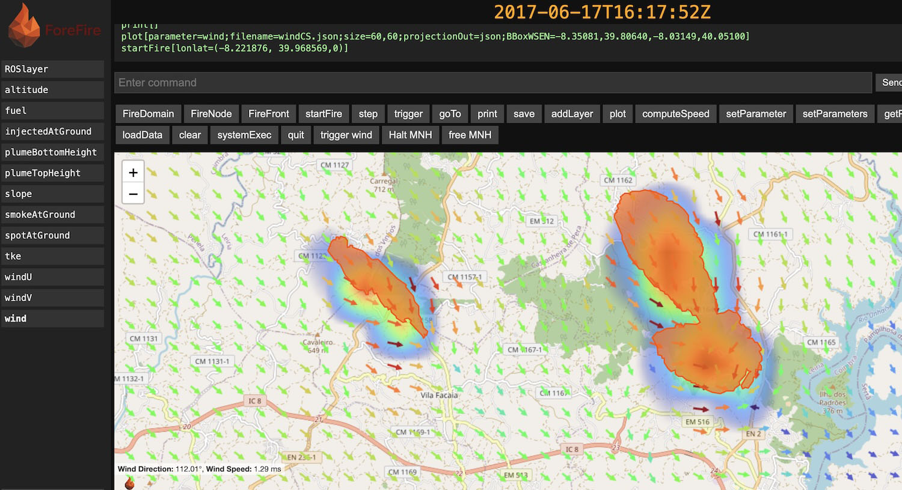

# Summary
Wildfire forecasting is at the same time an active research area and an important need for decision support systems. **ForeFire** is a modular, high-performance, scriptable, discrete‑event‑driven simulation engine [@filippi2009]. It is designed to model the spread of wildfire perimeters over large landscapes at meter scale resolution in seconds, serving both as a research platform and an operational forecasting tool. Core C++ library has Fortran and Python bindings and is accompanied by a lightweight scriptable interpreter (in custom FF language), a local HTTP service with customizable graphical user interface and can load, save and export data in NetCDF, GeoJson, KML, png and jpg. ForeFire can also account for fire-atmosphere interaction by two-way coupling with the MesoNH [@lac2018] atmospheric model [@filippi2013].

# Statement of need

Wildfire modeling tools have historically been split between **complex combustion research models** and **streamlined operational tools**, each with distinct limitations. 
Computational combustion and fluid dynamics (CFD) based models (e.g., FIRETEC [@linn2005] or WFDS [@mell2007]) are highly computationally intensive and yet unable to provide faster than real time large wildfire forecasting. 
Atmospheric coupled codes, such as WRF/SFire [@mandel2011] must be run within an atmospheric and requires a large amount of processing power and data.
Operational wildfire simulators such as widely used Farsite (now Flammap) [@finney1998] or Canadian Prometheus [@garcia2008] are able to simulate tens of kilometers long fire front in matter of seconds, but have definite built-in modeling assumptions and are distributed (freely) as compiled software with graphical interfaces anf hardly scriptable. 
ForeFire was developed as a community tool to fill the gap between highly complex customizable models and more rigid operational tools : a **unified** wildfire simulator that is both **adaptable** and **high-performing**. 

# Typical Use Cases

## Rapid prototyping of new spread or flux models
ForeFire implements several standard fire fluxes and spread rate models, such as Rothermel [@andrews2018] or Balbi [@balbi2009], but also makes it trivial to switch, extend or add to this withbase with a single `.cpp` using any existing model file as template.
Internally data is handled as *layers* that can come from Python NumPy array, supplied from input NetCDF files or generated on the fly by ForeFire (e.g. slope derived from the elevation layer). 
Developping a Rate Of Spread wildfire model was the original purpose of this simulation code and helped to iterate versions the Balbi Rate Of Spread formulation on real-cases studies in [@balbi2009] and [@santoni2011]. It also served to implement various heat and chemical species fluxes models used for volcanic eruption in [@filippi2021], plume chemistry [@strada2012] or industrial fires in [@baggio2022]. In addition, the code includes a generic `ANNPropagationModel`, which implements a feedforward artificial neural network (ANN) that expects a pre-trained graph file.

## Batch simulations with the ForeFire scripting
Custom FF language allows to easily generate multiple scenarios, including fire-fighting strategies, model evaluation [@filippi2014], ensemble forecasts [@allaire2020] or generate deep learning database deep learning [@allaire2021]. A FF script is a set of instructions that are interpreted real-time, with simulation updated with a `step`or a `goTo` commands or scheduled if post-fixed by a `@t=` operator. 
Each of these commands (such as, `goTo[t=42]`, `include[state.ff]`, `startFire[lonlat=(-8.1, 39.9,0)]@t=42`, `setParameter[propagationModel=Rothermel]` or `plot[parameter=speed;filename=ROS.png]`) can also be called  from HTTP, C++, Fortran or Python, and constitutes the core logic of the library. Help messages and autocompletion are directly available in the shell interpreter and can be run interactively. ForeFire includes a web‑based graphical interface (command `listenHTTP[host:port]`), through a local HTTP service with standard or user‑defined web pages as shown in \autoref{fig:gui}.

By utilizing pre-compiled datasets over extensive regions, this approach supports continent-wide operational forecasting services. It has been deployed to identify optimal escape routes [@kamilaris2023], integrated into the French National WildFire Decision Support System [OPEN DFCI](https://opendfci.fr/), showcased on the [FireCaster demonstration platform](https://forefire.univ-corse.fr/), and also currently used in commercial simulation services [AriaFire Firecaster](https://firecaster.ariafire.com), [UmGraueMeio Pantera](https://www.umgrauemeio.com/) and [Ororatech FireSpread](https://ororatech.com/all-products/fire-spread).

### Two-way coupling with the MesoNH atmospheric model
Same scripts can be executed coupled with the Open-Source atmospheric model [MesoNH](https://mesonh.cnrs.fr/) [@lac2018] with fire propagating using surface fields (wind) from MesoNH and forcing heat and other fluxes fields to the atmosphic model. Idealized coupled simulation can be run on a laptop at field scale [@filippi2013], but also supercomputer to forecast fire-induced winds of large wildfire [@filippi2018], fire-induced convection [@couto2024],[@campos2023] or even to estimate wildfire spotting [@alonsopinar2025].

Coupled simulations generates gygabytes of 3D data that can be converted to VTK/VTU files using Python helper scripts to visualize in Open-Source [ParaView](https://www.paraview.org/) as shown in \autoref{fig:coupled}. 

![Coupled simulation of the Pedrogao Grande wildfire [@couto2024] (Paraview). On the ground, the burned area is in orange, while among atmospheric variables, downbursts are highlighted in red and pyro-cumulonimbus clouds in blue.\label{fig:coupled}](coupled.jpg)

# Acknowledgements
This work has been supported by the Centre National de la Recherche Scientifique and French National Research Agency under grants **ANR-09-COSI-006-01 (IDEA)** and **ANR-16-CE04-0006 (FIRECASTER)**. The authors thank all contributors and collaborators who have assisted in the development and testing of the ForeFire software.

# References
