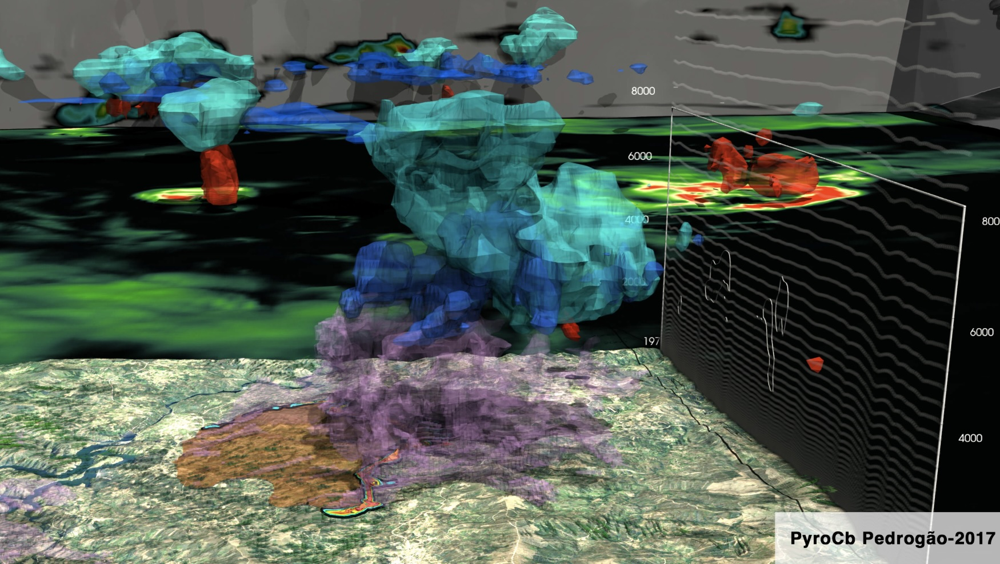

# Summary

**ForeFire** is a modular, high-performance wildland fire simulation engine implemented in C++. It is designed to model the spread of wildfire perimeters over large landscapes at meter scale resolution, serving both as a research platform and an operational forecasting tool. ForeFire can be used to forecast wildfires spanning thousands of hectares within seconds, supporting wildfire management operations, while also providing an open testbed for experimenting with new fire behavior, power, and flux models in a scientific context.

ForeFire offers multiple interfaces and utilities to maximize usability and integration. The core C++ library has Fortran and Python bindings (exposing arrays via NumPy) and is accompanied by a lightweight scriptable interpreter, a local HTTP service that enables a customizable graphical user interface and ability to load, save and export data in NetCDF, GeoJson, KML, png and jpg. ForeFire is discrete‑event‑driven [@filippi2009],  focusing computational effort on the active region of the fire front defined as a dynamic mesh or multipolygons of fire markers. 

All events can be attached to a timed command in a simple custom FF language that allows to easily generate multiple scenarios, including fire-fighting strategies or ensemble forecasts, with simple and light scripting efforts. Each of these commands (such as,`goTo[t=42]`, `print[state.ff]`, `include[state.ff]`, or `plot[parameter=speed;filename=ROS.png]`) of ForeFire is bound or can directly be called from HTTP, C++, Fortran or Python, and constitutes the core logic of the library, with a list of commands (a script) constituting a simulation scenario. Help messages and autocompletion are directly available from the shell interpreter that can be run interactively, with several examples provided in the repository.

The software also implements several standard fire fluxes and spread rate models, including different variants of the widely used semi-empirical Rothermel model [@andrews2018] as well as Balbi semi‑physical formulation [@balbi2009], with an architecture that makes it trivial to switch, extend or add to this model base. In addition, AI data-driven models can be used with the ability to activate feedforward graphs trained externally (e.g., with TensorFlow or PyTorch) and serialized in a compact binary format. 

Eventually ForeFire is also capable of two-way coupling with the MesoNH [@lac2018] atmospheric model to account for fire-atmosphere interaction [@filippi2013] such as fire-induced winds, or intense fire convection clouds (using MPI to scale with a high number of computing cores). This combination of high-performance computation, modular physics, and multi-interface support makes ForeFire a uniquely versatile Open-Source tool for wildfire simulation.

# Statement of need

Wildfire modeling tools have historically been split between **complex combustion research models** and **streamlined operational tools**, each with distinct limitations. On one end of the spectrum, computational combustion and fluid dynamics (CFD) based models (e.g., FIRETEC [@linn2005] or WFDS [@mell2007]) provide detailed physics with complete control of combustion models at flame scale but are highly computationally intensive and yet unable to provide faster than real time large wildfire forecasting. On the other end, operational wildfire simulators built for practitioners, such as widely used Farsite (now flammap) [@finney1998] or Canadian Prometheus [@garcia2008], while not resolving the combustion at flame scale, are able to simulate tens of kilometers long fire front in matter of seconds, prioritizing speed and simplicity at the expense of generality. These codes have definite built-in modeling assumptions and are distributed (freely) as compiled software with graphical interfaces and limited access to source code. Being so well packaged is great for direct use of the code, but makes it difficult for researchers to implement new modeling approaches and streamline or script integration into different experimental frameworks. This gap between highly complex customizable models and more rigid operational tools creates a need for an intermediate solution: a wildfire simulator that is both **adaptable** and **high-performing**. **ForeFire** was developed to fill this need by bridging the flexibility of research-oriented code with the efficiency and user-friendliness of operational systems [@filippi2018].

Other open source libraries for wildland fire spread do exist as for example ElmFire [@lautenberger2013] or Cell2Fire [@pais2021] but are tied to a single spread models and do not provide a versatile scriptable interface (they are run with input files and produce), making it difficult to incorporate alternative fire spread physics or custom behaviors beyond the provided formulation. Another family of wildland fire spread solvers such as WRF/SFire [@mandel2011] can resolve coupled front propagation and local meteorology but fire propagation must be run with the atmospheric model requiring a large amount of processing and data.

Each of the above systems addresses certain needs (e.g., operational use, physical fidelity, or coupling) but none provides a **unified solution** that is open, modular, and performant.  At the same time, ForeFire’s **modular physics engine** and scripting interface allow users to *easily swap or implement new fire spread models* (from simple empirical rules to advanced semi-physical models) without changing the core code. The software can run in a standalone mode (for purely surface fire simulations) or be **coupled** with atmospheric models under a consistent interface, using similar initialization and data inputs for either mode.

ForeFire’s support for **multiple language bindings** (HTTP, C++ API, Python/NumPy, Fortran) is also unique an further expands its usability across different domains. These capabilities enable **rapid prototyping** and experimentation with fire behavior algorithms – researchers can test novel modeling ideas or incorporate machine-learning-based fire spread predictions within the ForeFire framework – and also support operational needs by allowing integration into decision support pipelines and coupling with weather forecasts.

## Some typical Use Cases

### 1. Rapid prototyping of new spread or flux models
Researchers who wish to experiment with alternative formulations can add a new model by adding a single `.cpp` file from the `src/propagation` or `src/flux` using any existing model file as template and implement the `getSpeed()` or `getValue()` function. Input variables—including fuel descriptors, wind components, or slope—are declared at the top of the file. Internally these quantities are handled as *layers* that can come from Python NumPy array, supplied from input NetCDF files or generated on the fly by ForeFire (e.g. slope derived from the elevation layer). Once compiled, the new model is available in the scripting interface and in the C++/Python APIs without additional changes.

Typically this the original purpose of this simulation code and how version of the Balbi Rate of spread formulation were tested and developed on real-cases studies in [@balbi2009] and [@santoni2011] and various heat and chemical species flux models used for volcanic eruption simulations in [@filippi2021], wildfire plume chemical compounds in [@strada2012] or industrial fires in [@baggio2022]. There is also a generic `ANNPropagationModel` that expects a trained graph input file that will be used in place of these functions. 

### 2. Batch simulations with the ForeFire scripting
The lightweight script interpreter allows users to easily create simulation scenarios without having to change all data input files, with scripting files that can be generated by another process (interpreter can be piped in a shell script). A FF script is a set of instructions that are interpreted at a specific time, either simulation time (starting at a run date, with 0 defined as `00:00` and updated with a `step`or a `goTo` commands) or if the command is post-fixed by a `@t=` operator that schedules the execution of the command. A typical script that loads data at a date and time, starts a fire, schedules a wind shift and prints outputs as:
```text
setParameter[propagationModel=Rothermel]
loadData[data.nc;2025-02-10T17:35:54Z]
startFire[lonlat=(-8.1, 39.9,0)]
trigger[wind;vel=(10.0,0.0,0.)]@t=75000
step[dt=36000]
print[]
```
But the interface can also be run with a highly customizable web‑based graphical interface with command `listenHTTP[host:port]`, that starts a local HTTP service with ForeFire bindings and serves standard or user‑defined web pages such as in Figure 1.


With pre-compiled datasets over a large area, it enables simulation services of continent‑wide operational forecasting, to find the best escape routes [@kamilaris2023] or in the French public national WildFire Decision Support System [OPEN DFCI](https://opendfci.fr/), in the [FireCaster demonstration platform](https://forefire.univ-corse.fr/) while also of use in several commercial companies. 

But the ability to run as batch also means it can be used to perform systematic model evaluation [@filippi2014] generate simulation ensembles [@allaire2020] or large simulation databases for deep learning [@allaire2021,@allaire2022]

### 3. Two-way coupling with the MesoNH atmospheric model
The same scripts and input data can be executed in coupled mode with Open-Source atmospheric model [MesoNH](https://mesonh.cnrs.fr/) [@lac2018]. In this configuration MesoNH launches ForeFire (FORTRAN Bindings) as an MPI enabled sub-process, a master rank integrates the fire perimeter using surface fields from the atmospheric model and distributes fluxes fields to the atmosphic model. Sample coupled cases are available in the main [MesoNH Repository](https://src.koda.cnrs.fr/mesonh/), but typically ForeFire is parameterized or scripted in the same way in coupled or non-coupled mode with the same files (or HTTP interface) that can be used to perform a simulation run. In coupled mode, simulation can be run at field scale to evaluate model ability on prescribed and instrumented experiments [@filippi2013], but also faster than real-time simulation of fire-induced winds on a large wildfire [filippi2018], fire-induced convection during an extreme wildfire event [couto2024,campos2023] or even to estimate wildfire spotting (firebrands) with a resolved fire plume [@alonsopinar2025].

While simulations in coupled mode can take significantly more time and generate much larger output files, they are designed to run efficiently on a supercomputing cluster with some specific routines to generate 3D output files through ForeFire. Python helper scripts available in the ForeFire repository convert these simulation outputs to VTK/VTU files, allowing three-dimensional rendering of fire-atmosphere variables in Open-Source [ParaView](https://www.paraview.org/) such as Figure 2. 



# Acknowledgements
This work has been supported by the Centre National de la Recherche Scientifique and French National Research Agency under grants **ANR-09-COSI-006-01 (IDEA)** and **ANR-16-CE04-0006 (FIRECASTER)**. The authors thank all contributors and collaborators who have assisted in the development and testing of the ForeFire software.

# References
